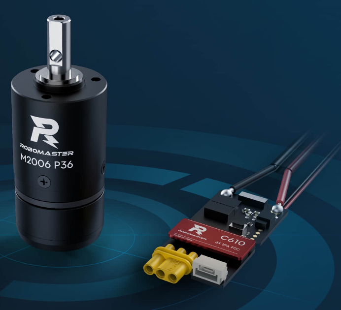

# DreamChaser 2024 Infantry Doc

这是北京理工大学机器人队24赛季步兵电控文档，介绍步兵机器人软硬件结构，以及对步兵电控的工作做出说明，由24赛季步兵电控黄瑞祥编写。

24赛季所有步兵均使用此套代码，麦轮和全向轮步兵由不同的人负责跟车，代码稍有差异；平衡步兵相较于前两者还有电子元件上的差别，代码差异会更大一些。所有步兵使用的外设和算法库的代码是基本一致的，仅在应用层有所差别。本人主管全向轮步兵，故以全向轮步兵为例编写此文。


## 机器人展示


## 硬件结构

### 连接拓扑

一台步兵可分为底盘和云台两部分。

供电线连接大致为，电池给电管供电，电管根据比赛情况控制底盘、云台、发射机构和小电脑的供电情况，底盘云台之间用滑环进行连接；底盘供电由于规则对功率限制的要求，计入功率计算的轮电机经过超电控制板接入电管，其他部分直接接入电管；云台供电由滑环从电管给到云台板上，云台板再分给其它机构。

信号线连接基本为自研板端到端连接到各个元件上，较为简单。

电路拓扑图如下（图片源文件在README.asset目录下，后缀名.eddx）


### 各模块说明

先对本赛季步兵使用的各个元件和基本接口进行说明，官方产品请查阅文档的详细使用说明，此处仅给出接线说明。阅读这部分之前，请先对比赛规则和机器人制作规范有基本了解，且最好对照实物进行学习。

- xt30的公母头：左为母头，一般用于出电；右为公头，一般用于入电。xt60类似，型号大一些而已。


- 底盘板：底盘上的中心控制板。一个xt30公头给板子供电，连接一分三分电板的出电口；can1控制四个3508电机和yaw轴6020电机；can2用于底盘板和云台板的板通；can3用于底盘板和超级电容板的板通；uart2用于与裁判系统电管通讯(使用4pin转3pin的线)；swd用于调试；按键用于复位。

    

- 云台板：云台上的中心控制板。云台板在这一年有四个版本的迭代，功能没有太大变化，板子上也都有丝印，具体可见硬件组的自研板修改记录。can1控制pitch轴6020电机和拨弹轮2006电机；can2用于云台板和底盘板的板通；按键用于复位。

- 超电板（超级电容控制板）：位于底盘。由于比赛有功率控制和缓冲能量机制，超级电容这一元件可以在保证机器人不超功率的前提下，提高机器人的移动速度。超电在这一年也有几次迭代，但面向电控的接口没有变化。can3用于超电板和底盘板的板通。调试时可以不接入，裁判系统Chassis口直连一分四分电板的入电口即可，但不接入时容易超过比赛规则中的功率限制。

    

    

- 电容组：与超电板成套使用，位于底盘，通过电容管理模块与超电板连接。一个xt30口，连接电容管理模块的SuperCap。

    

- 分电板：需要用到两种分电板，全部位于底盘。

    - 一种是xt60转一个xt60和一个xt30的（一分二分电板），xt60入电接电池架，xt60出电接电管，xt30接降压模块的入电口。也可以焊一根比较抽象的转接线代替（但由于焊接可靠程度问题，建议使用专用的分电板）；需要这样连接的原因是，电管的minipc没有短路保护，使用minipc供电有损坏小电脑的风险，而minipc口的供电在比赛过程中始终保持给电状态，所以小电脑的供电可以由电池直供。

        

    - 另一种是xt30的一分四，底盘上需要两个，一个是完整的一分四且需要分can，另一个只用到了一分三且不需要分can，使用自研或官方的均可。

        

        

- 电管（裁判系统——电源管理模块）：电管位于底盘，连线较为复杂。

    - 四根航插线，一根黑色接头连接裁判系统主控，另外三根银色接头等效，一根连接灯条，一根连接滑环，另一根备用（注：官方裁判系统硬件的航插线均为公头，连接时很多地方需要添加母对母航插线）。
    - 四个xt30出电口，分别为Chassis、Gimbal、Ammo-Booster、MiniPC。Chassis连接超电控制板；Gimbal连接一分三分电板；Ammo-Booster不使用，原因在后续的抽象问题合集中说明；MiniPC没有短路保护也不使用。一个xt60入电口接一分二分电板。
    - 其它接口，两个Armor与四对装甲板支架连成环，RFID通过包有锡箔纸的4pin线连接裁判系统RFID模块，CAN1通过4pin线连接裁判系统电容管理模块，两个RxTxG任选一个通过3pin转4pin线连接底盘板uart2。

    

    

- 滑环：穿过yaw轴6020的中孔，用于云台和底盘之间的供电和信号传输。目前采用24线滑环（不使用ammo-booster后其实只用到18线），一个xt30口有两根AWG硅胶线，考虑到每根滑环线可以通过的电流有限，每根AWG线焊接三根滑环线，故每个xt30口连接6根滑环线；需要两根xt30口，分别用于电管的Gimbal和电池直供的小电脑供电；两根滑环线用于底盘板和云台板的板通can线；四根滑环线用于焊接母头航插线，连接电管银色航插头；2*6+4+2=18，共使用18根滑环线。

    

- M3508电机及C620电调：作轮电机使用，位于底盘。电机连接电调，电调的供电线和can线连接一分四分电板。本赛季有使用更换减速箱的3508电机，但对电控的接口没有变化。

    

- M2006电机及C610电调：作拨弹轮电机，位于云台。电机连接电调，电调的供电线和can线连接云台板。

    

- snail电机及C615电调：作摩擦轮电机，位于云台。电机焊接到电调上（线序为：电调有R标一侧看，左摩擦轮蓝灰红，右摩擦轮红灰蓝）（摩擦轮对电机转向有要求，而转向受线序影响，故此处需要强调线序）；电调信号线剪掉自带的杜邦线接口，重焊为3pin接口并连接云台板，线序颜色对应可查看老车（电调自带的杜邦线接口和云台板不兼容），供电口连接云台板。

    

    

- GM6020电机：作yaw轴和pitch轴的云台电机，前者位于底盘，后者位于云台。yaw轴电机供电连接一分三分电板，can线连接底盘板，pwm接口不使用；pitch轴电机供电连接云台板，can线连接云台板，pwm口不使用。

    

- 编码器：用于获得摩擦轮转速，位于云台。由于步兵目前的摩擦轮电机使用snail电机，为了以提高弹丸发射时的响应速度，需要采用闭环控制，而snail本身没有编码器，故需要外置编码器获得摩擦轮转速，目前使用1024线或4096线编码器。

    [购买链接](https://item.taobao.com/item.htm?spm=a1z09.2.0.0.410b2e8dacHGP0&id=621980558082&_u=f20egmb4927f3c&pisk=f0On0agZQpWC_wz-xCfIeKPFHFDOAk1Wa3FR2_IrQGSsPJeKRT7yr3AJpUSRZ3xkqMBrA6dkjET-RQ3CTbbyDhfJJMIJj4xpP7nIF6FzqHTqAeI-RQjPjH-lF2sR4gxJzp3tMjLBR_1PqmhxMMZgG5t3TgSrzO7lzdLUpr8BR_syLUOZDewoWFbvaT-P_O7ll_7FU_7ZSaQbY_SFUlyNuGSPa_-P_57C-k7P497a_bLsLMOy_CoestMx4_WXswXZBeSZtEdN-NsD8hFQOz_hKi8FfmBCz-BwPTA7P7XJ8Kt5uHrEqgOM7BJ20cedYKbkkLxqyJ_OEB1G4BlboGRHrCXBBkyFo6jh3BW3kqTCUdAG9Bo7hFLGYtf9BAide6xHhi6ECctkSMKytOrnXgpvWBWM0cFMVTvy91REbjjPRRyVpLP574daF86F5NjjH2BlbkuuLhuiS-u5LN_CDV0gF86F5NjxSV2qN971RiC..)，型号选择单端1024，脉冲线数为ABZ1024线（4096线类似）。接线上，编码器的5pin需要焊接到和云台板对应的4pin接口，线序颜色对应可查看老车。

    

- 充能（荧光充能装置，本质上是两个灯板）：位于云台。由于比赛规则的要求，且为了方便调装甲板自瞄和能量机关击打（简称打符）时慢放观察弹丸落点，需要该装置对弹丸进行照射使其发光（小弹丸含有荧光材料，经灯板照射后会发光一段时间）。接线上右边的等边接到左边控制板上，控制板的xt30连接云台板获得供电。

    

- 接收机和遥控器（DR16和DT7）:接收机接收来自遥控器或者键鼠的信号，控制整车运动，位于云台。接收机自带3pin的杜邦线母头接口，和云台板对应针脚直接连接即可，线序可参看接收机手册和云台板丝印。

    

    

- 小电脑：自瞄运算平台，目前使用Intel NUC，位于云台。供电口为DC口20V，由24V经降压模块得到；两个USB-A口一个接USB-A转工业相机USB3.0到相机，另一个接USB-A转microusb到云台板。

    

    

- 降压模块：将电池电压24V转为20V，位置可灵活安排。目前使用19V降压模块，也能够使用，但偶尔会出现问题，以后需要全部换成20V，入电接一分二分电板的xt30出电口，出电接一根xt30转DC口转接线到小电脑上。

    

- 相机：获得图像供自瞄使用，需配合镜头使用，位于云台。上方圆孔通过焊接的相机触发线连接云台板，线序颜色可参看老车；下方通过工业相机USB3.0转USB-A连接小电脑。

    

- 电池架及电池：连接一分二分电板的入电口，为整车供电，位于底盘。


- 电容管理模块（裁判系统——电容管理模块）：串在电容组和超电板之间，用于检录时测试电容是否符合制作规范，位于底盘。PwrCtrl连接超电板，SuperCap连接电容组。训练调试可以不接入，电容组直连超电板即可。


- 主控（裁判系统——主控模块）：设置机器人的比赛规则参数，连接比赛服务器以及完成一些检录项目的控制中枢，使用电管时必须接入主控才会给机器人上电，位于底盘。连接电管黑色接头航插线。

    

- 装甲板及其支架（裁判系统——装甲模块）：机器人的击打目标，位于底盘。装甲板支架固定在整车骨架上，装甲板从下往上扣在支架上，构成一面的装甲板，普通步兵有四面装甲板。用6pin线将四面装甲板支架以及裁判系统电管的两个Armor口串联成一个环。

    

    

- 灯条（裁判系统——灯条模块）：显示机器人血量，位于底盘。与电管银色航插头连接。训练调试可不接入。

    

- RFID（裁判系统——RFID模块）：与场地交互卡配合使用，读取机器人在特殊位置的增益，位于底盘。通过包有锡箔纸的4pin线与电管RFID口连接。调试可不接入。

    

- UWB（裁判系统——定位模块）：获得机器人在小地图中的位置，位于云台。连接云台航插线节点末端即可。调试训练可不接入。

    

- 枪管（裁判系统——测速模块）：读取弹丸出射速度并计算热量反馈给裁判系统，位于云台。带有两根公头航插头，串在云台的航插连线中即可。

    

- 图传（裁判系统——图传模块）：为操作手提供画面，分为发送端和接收端，发送端固定在机器人云台上，接收端和电脑连接。发送端带有两根公头航插头，串在云台的航插连线中即可。

    

    

    

### 注意事项

1. 官方产品，包括官方电机电调、裁判系统硬件等，大部分使用说明和指示灯、蜂鸣器表示的异常情况均可在手册中找到。
2. 所有电路板包括电容组背后贴胶作绝缘保护后，再固定在车上。
3. 不要电池直供给自研板上电，浪涌电流容易把板子干穿。
4. 目前底盘板不需要imu，可以使用纳米胶固定，云台板含有imu，需使用螺栓固定，确保云台板和云台其它机械结构的绝对固连。
5. 焊接时不要将导线搭在车的碳板上，且焊锡丝碎屑等不要掉进车里。因为许多裁判系统和电机外壳导电，用螺栓将它们固定在碳板上时必定会导致机械地和电路地共地，因此一旦有导电物质接触碳板，极有可能烧毁电器元件！
6. 不要将螺栓、六角螺丝刀或蓝牙usb等一切可导电的小零件掉进车里，理由同上；但这种情况难以避免，发生时须及时取出。
7. 滑环线十分娇贵，剪一点短一点。焊接过程中，使用剥线钳去掉外皮时要格外小心。
8. can线、电调信号线、装甲板6pin线、相机触发线、usb通信线等一切可能松动的线上热熔胶，卡扣缺失时应更换。xt30线能用扎带固定的尽可能使用，不能使用且容易松动的，用针状物质撬动xt30口的公头凸起使其微微变形以加固连接。
9. 布线时，各种线路的长度需根据机器人具体需要选取或焊接，不可过短导致线路绷紧始终受拉伸力，容易断掉；也不可一味求长导致大量没必要的线路堆积，在恰当长度的基础上留有少量余量即可。（调试线除外，可以焊长一些，方便且安全）。所有线路但凡出现破皮，需视情况立即更换或用电工胶带补救。所有线路尽量贴着机器人表面进行，合理使用扎带或束线器，方面机械对必要之处作防护，尽可能避免线路悬空。
10. 电机不要长时间堵转或高频抖动。电机控制不了的debug思路：先看有无数据反馈，无数据反馈优先看信号线是否松动，再看代码id配置，can是否有错误码；有数据优先看供电线路是否松动，以及用万用表测定供电是否正常。以上均没问题则有理由怀疑电机或电调本身硬件坏了。
11. snail电机是pwm控制的电机，给固定频率信号可以更改转向和进行行程校准，代码中已经规避了，测试时如蜂鸣器有异常响声则需根据手册查找并解决问题。
12. 充能装置需要同时使用提供的两片灯板，用热熔胶和扎带固定在出枪管前一段的弹丸链路即可。
13. 编码器配套的磁铁需提醒机械的同学安装在编码器正中间。爱护snail电机外套的胶轮，不要使用过脏过黏的弹丸，更不允许将扎带螺栓等杂物混进弹舱，它们均在胶轮上留下凹坑，严重影响弹道！
14. 接收机的天线需要露在外面，比赛场上的电磁干扰非常大，本赛季在国赛现场出现过多次遥控信号不好的现象。遥控器已经停产，新遥控器的使用需要找老师申请，现有的遥控器也十分宝贵。遥控器的天线需要用热熔胶糊死，或者使用机械制作的打印件，固定天线尽量减少其移动。拨杆建议固定饮料瓶盖以减少其与外界的碰撞。
15. 小电脑的四个窄面均需要防护，以免电源按键或拓展接口等被弹丸打变形失去正常功能，防护时需注意其进风口和出风口，不可阻碍其正常散热。
16. 相机镜头防护和相机镜头需保持相对固定，且二者均需注意保持清洁，可用视觉专用的擦拭纸进行清洁。
17. 电池有TB47S和TB48S，47S和48S在能量和容量上略有差别，对于步兵这样一辆车只用一块电池的机器人没有影响，对于需要同时使用多块电池的机器人则需要注意，每次最好使用同样型号的电池，无人机还要注意贴好标签，每四块电池为一组，一组同时使用同时充电，以保证无人机的飞行姿态不会因电池能量不均而不稳。除调试无人机外，不允许使用贴有无人机专用标签的电池。另外，电池有双卡扣和卡扣不全之分，电池架也有卡扣和绑带不齐全的状态，上场的机器人需配备完好的电池架和双卡扣电池。
19. 主控模块用于规则参数设置、连接服务器、完成检录时的某些项目，其常用功能需要十分熟悉。
20. 装甲板时有灯条损坏，传感器损坏等情况。在调试装甲板自瞄时需要更换完好的装甲板，否则不影响。所有的裁判系统硬件更换可以在区域赛和全国赛的现场进行，平时发现的裁判系统硬件损坏注意保存好并做好记录，比赛时一并更换。
23. 在有训练安排时，需经常性的检查防护是否完好，线路是否有被弹丸打到的风险，以及是否有干涉，重力补偿机构是否正常等。必要的地方重新切板子，增加海绵泡沫，上扎带，打胶等。
24. 调试时，疯车疯头是常事，入门阶段建议把车放在架子上调，注意轮组、电池等是否与车架干涉。这时由于imu有一定零漂，且底盘带有随动，轮子会空转，此时关闭随动即可。


## 软件结构

### 代码架构

整车代码分为底盘和云台，两个工程目录结构类似

```
├─Core
│  ├─Inc
│  └─Src
├─Drivers
├─MDK-ARM
├─Middlewares
├─patch
└─User
    ├─Algorithm	
    ├─Application
    ├─Infantry
    ├─Library
    ├─Peripheral
    ├─Protocol
    ├─System
    └─Utility
```

目录说明：patch目录包含从ac5编译器转ac6编译器需要移动的文件，与patch_ac6.bat这个批处理文件配合使用，在CubeMX重新生成代码后会自动运行；Core、Drivers、MDK-ARM、Middlewares目录均由CubeMX自动生成，一般无需改动；User目录为核心代码，以下对该目录进行详细介绍。

User中，System是系统级的功能库，目前只提供了DWT时钟；Utility是对自研板上PWM、UART、CAN等外设HAL库的封装；Peripheral为对电机、陀螺仪、遥控器等外设的驱动；Library为数学运算、滤波器等常用工具；Algorithm为算法库，目前只有PID和卡尔曼滤波；Protocol为裁判系统和小电脑通信的协议；Application为应用层，包含各个任务的代码组织。Infantry目录为配置性的代码，包含所有回调函数、rtos任务、初始化参数表。

熟悉代码时，建议从Infantry层的task_ctrl.c开始，此文件包含了所有的任务，每个任务中调用并依次执行Application层中的函数；其它层均可以视作库文件，用到对应的功能便调用其中的函数。绝大部分函数和变量名已经规范了命名，比较直观，稍微熟悉之后应该能够通过函数名或变量名直接知道其含义。Infantry层中的init_ctrl包含了所有的外设及其参数初始化。调车更改功能或日常维护测试时，一般只需要修改Application层和Infantry层。

对于部分根据实际需要写出而不那么容易看懂的代码片段，已经在代码中作了注释。注释集中在Applicaton层，底盘工程中的app_chassis.c，云台工程中的app_remote.c以及app_shoot.c三个文件的逻辑最为复杂。

### 工具链

使用CubeMX生成代码，keil编译烧录并进行简单调试，Ozone进行需要查看波形的调试。

CubeMX版本目前使用V6.10（本人电脑使用最新的V6.12并使用最新的固件库会有问题），keil版本为5.38，编译器版本为ac6(armclang V6.19)，Ozone版本可以更新到最新（目前为V3.34）。


关于工具链的配置及使用说明，可参看电控组的统一规范，或根据该配置查阅相关工具的使用说明。


## 后续计划

大方向来说，肯定是根据新赛季的规则作针对性调整。步兵这边目前猜测的方向有：半自动步兵，舵轮步兵。

这套代码在24赛季被称为“老框架”，经过了历代老学长的传承，是经过了赛场检验的稳定代码，没有经过合理的分析和测试，不要轻易改动。然而，出于赛季中对进度的考虑，这套代码没来得及融入一些现代的控制方法和代码的设计模式，包括对很多问题采用短平快的原始解决方式，缺乏理论基础。下面是一些可能的后续计划，希望后续的队员能根据进度综合考虑并进行完善。

1. 完备的错误记录和错误处理系统

    在调车过程中，尤其是代码改动和新功能开发时，电控总会遇到诸如通信断联、程序跑飞、电机工作异常等问题，为了快速定位并解决问题，提高机器人在场上的稳定性，一个完备的错误记录和错误处理系统是有必要的。建议和硬件组的成员合作完成这个工作。

2. 电控的工作重心向能够直接提高车性能的控制上靠一靠

    电控的核心工作——控制，可以说是直接决定机器人性能的一大要素。比起简单粗暴的，工业界最广泛使用的PID加一堆简单的逻辑，更应该尝试系统建模，参数辨识，状态观测与估计，控制器选择与设计等现代化的控制方案。PID应用广泛的范畴，是针对整个工业界的，包括像大型厂房、化工生产这样一旦出错便会带来巨大经济损失、威胁声明安全这样的应用场景。这样的场景对稳定性的要求远高于系统性能的最优化，而PID可以无模型整定参数，换句话说就是，系统性质的微小改变不会对响应性能有质的改变。另一个场景是给用户的产品，道理类似，为了降低长期以来的维护成本，选择了容错度较高的PID。这是PID在工业界盛行的原因。但，我们是搞机器人比赛，没有这样的需求限制，在赛季前期的研发阶段，大可不必将自己的上限定在简单的PID。（当然PID是必须掌握基础，高级的控制算法多在上层使用，到了直接跟执行机构打交道的底层，还是以PID居多）

    另外，希望硬件组的同学具备能够完成大部分目前电控所完成的工作的能力。这样电控才有更多的精力去做上述提到的，直接提高车的性能上限的工作。）


3. rtos的使用和代码性能的提高
    这套代码中仍然存在中断中进行解码，没有进程间交互，无法检测系统性能，rtos任务执行频率跳变等问题。机器人能够正常使用，但这些问题的解决能带来更高的效率。
4. 流程化单元测试的设计
    每次改动代码，都应该进行完整的测试以保证本次的改动不会影响到原有功能的正常运行。单元测试的存在，可以提前发现问题，将bug扼杀在摇篮里。
5. 适当将编码器和摩擦轮靠近一些，能够减小摩擦轮噪声；同时增加摩擦轮转动部分本身的重量可以增大其转动时的角动量，理论上在发射弹丸时对摩擦轮弹速降低的干扰会更小，对响应时间要求会宽松一些，可以让弹速在高射频下更加稳定（机械后续如果改图可以考虑以上两点）。
6. 小电脑等云台部分较重的模块,距离yaw轴转轴尽量近一些，以减小转动惯量获得更快的云台响应，提高自瞄上限。
7. 飞坡控制和一键飞坡，具体可见“常见问题”中关于飞坡的部分。


## 与其它技术组合作

- 机械：熟知整车电气元件和线路的布置与防护，简单了解机械做防护的方式并在布置时尽可能减少他们的麻烦。

- 视觉：知道与nuc的通信协议，整定云台参数以满足自瞄的响应需求，主动协助完成自瞄开发过程中的辅助工作（如提前备车，防止疯车，修改帧率，靶车，捡弹丸，修理能量机关等）

    与视觉的通信协议

    电控发送给视觉：

    

    电控接收视觉数据：

    

- 硬件：知道与超电的通信协议，协助完成超电的功率测试，做好自研板的防护并规范使用

    与超电的通信协议

    电控发送给超电


电控接收超电数据


由电控完全控制的，云台板和底盘板板通的数据传输大致为：

底盘发送给云台：云台板所需要的裁判系统数据

云台发送给底盘：底盘板所需要的遥控器/键鼠输入

具体协议在protocol_board.c文件中，此处不再罗列


## 本赛季常见问题及解决方案

前期可能由于对线路不熟悉、焊接及线路固定不规范、代码配置不对、或是硬件本身质量问题等导致机构工作不正常，这个阶段建议连接调试器进debug打断点观察变量等方式，并综合线路连接检查，以快速定位问题，永远不要猜问题出在哪里，而是直接找出证据。

下面列出代码运行正常，但车的性能不正常的综合问题。

1. 车持续不走直线、小陀螺划船：云台松动或悬挂高度不一致，需要机械检修；或者轮子工作不正常，需观察四个C620电调指示灯状态对应解决问题。
2. 车在运动过程中偶有不走直线：某个电调有重启现象，或是线路松动。前者是由于电调掉压引起的，在本赛季已经由硬件组组长在超电和功控代码中解决；后者检查线路连接即可。
3. 小陀螺偏心：四个轮子到实际旋转中心距离不一致，对于四轮步兵而言，这种偏心一般比较小，可以接收，若操作手反映影响较大，可在小陀螺运动解算时根据偏心方向手动乘以距离系数。
4. 飞坡失败：这是个综合性问题，目前已经研究出的影响飞坡的因素有，车辆重心分布不合适、速度过慢或过快、加速过程或出坡走歪、电容剩余能量不足、操作手偶尔失误。重心分布的问题表现为出坡和落地姿态，若底盘以较小角度整个拍在落地点则是合理的姿态，若出坡前倾过快落地时导轮着地依靠导轮矫正姿态则说明重心分布可能不合适。本赛季国赛麦轮飞坡姿态良好，全向飞坡姿态便是导轮着地，受比赛场地限制飞坡并不稳定。在飞坡速度上，对于本赛季的分区赛全向而言，用四个轮子正运动学解算得到的速度在4.2m/s~4.5m/s范围较为合适，过快过慢成功率均会显著降低。加速走歪的问题由于全向的轮组布置使得其更容易原地转向（麦轮几乎没有这个问题），具体表现为，在加速过程中，由于四个轮电机体质包括轮组结构等不可能做到完全相同，移动过程中底盘会略有倾斜，这一点在飞坡的加速起步阶段尤为明显，但底盘随动云台可以起到一定的校正作用，而一旦底盘和云台有一定夹角，运动学逆解得到的轮子速度期望就不可能完全相同，PID控制轮子的实际速度也就略有差别。而随动由于3508本身存在一定空程不可能无限度调硬，因此一般来说全向的随动在保证底盘不抖动的前提下调硬一些，剩下的便需要根据操作手根据自己的操作习惯和场地地胶等因素，在加速阶段自行操作调整。最后两个原因（电容能量和操作手失误）都是操作手需要注意的问题，一般来说，飞坡前的电容能量保证在50%以上较为保险，同时不要手贱按错或犹犹豫豫，这两点加以练习不成问题。关于飞坡的操作，如果可行建议可以做成自动化的一键飞坡，再小电脑上识别车道线并自动校正使得飞坡过程中车尽量处于道路中央。
5. 全向轮滚子选择，白色滚子在国赛地胶上有更好的性能，功耗相同时跑得略快于黑色滚子。但两种滚子的轮电机PID参数不同。本赛季将黑色滚子的参数复制给白色滚子，操作手反映会出现类似“脚滑”的现象，即刹车性能较差。重新调节轮电机PID参数即可。
6. 功控：23赛季的功控在场上出现了大问题。本赛季，队员zch用辨识建模的方法一劳永逸地解决了功控的问题，只需要在装新车时将轮电机的参数辨识准确即可。另外，由于这部分代码更适合用C++编写而本人C++基础薄弱，这部分代码由擅长C++的zch完成，本人水平不足不敢随意改动，故这部分代码风格与工程中其它代码大不相同。与此情况相同的代码还有UI部分，亦由zch完成。）
7. 本赛季麦轮出现过整车上电底盘莫名乱动几秒的情况，debug后发现，是轮电机数据的期望和反馈数据不同步造成的，刚上电时会出现期望已经发给了轮电机，但轮电机的反馈还没有返回，控制器认为反馈为0，输出拉满，所以底盘乱动，加上电机离线检测后解决。同时为了解决进debug或烧录云台代码时yaw轴失控需要用手扶住的问题，增加了板通的离线检测，板通断联后，底盘控制的5个电机均会失能。
8. 整车上电后在不动的情况下云台自己漂移：遥控器零漂或imu零漂，关闭遥控器观察现象是否存在，如消失则为遥控器零漂；否则为imu零漂，在periph_bmi088.h中更改IF_CALIBRATE宏定义为1，在静止情况下重新上电校准，并将头文件中的GX_OFFSET,GY_OFFSET,GZ_OFFSET,GNORM更新为校准后的即可。
9. 在控制参数正常的情况下云台莫名抖动/参数变质：机械存在空程，云台板没有固定好，负载有所变化，参数整定地过于最优等都有可能。这里解释一下最后一点，参数过于最优会导致一点点系统性质的变化便对响应带来了质的改变，此时需要将参数调软一点。当然，控制参数的最优性和鲁棒性是一对永远存在的矛盾。在步兵上一般来说，首先检查空程，通常来说将空程解决问题就解决了，反之则修改参数，若参数也修改到足够软但问题仍然没有解决，就需要具体问题具体分析了，比如检查控制频率，代码运行的时序等等。
10. 在控制参数正常的情况下底盘莫名抖动/参数变质：与上一条类似，yaw轴存在空程，或固定yaw轴电机的螺丝松动，或随动参数过于极限。注意，3508电机本身带有一定空程，但对于一套能够满足操作手要求的随动参数来说，不足以引起底盘抖动，所以检查无机械上的空程后将参数调软即可，留有少量死区是可以接受的。
11. 3508电机有时会因为轮组机械结构的原因，车在地上跑时正常，放在架子上电机尾部会与碳板干涉，摩擦发出沙沙声，下电提醒机械检修即可。
12. 拨弹盘2006蜂鸣器异响：通常是电机堵转造成的（其它异常情况可查阅手册），此时应检查拨盘是否卡死，本赛季使用的新拨盘从7月初换上到8月中旬打完比赛还没有出现过卡死的情况，目前认为不会卡死；对于本赛季的老式拨盘则有小概率卡死，确认卡死后应立即下电，取出卡住的弹丸，检查拨盘光固化打印件是否松动，拨齿是否歪斜，分弹片是否碎裂等，提醒机械检修。
13. 发射卡预置：弹丸过了预置但摩擦轮此处时停止状态，由于snail的特性，此时无法起转，导致无法发射。此时用手稍微用力拨动摩擦轮将弹丸挤出即可。这个问题在本赛季已经通过更改供电走线的方式得到解决。原本的触发方式和解决方案为，当机器人正在射击时发射机构被下电（比如被击杀或者允许发弹量打空而弹舱中还有实体弹丸），在重新上电后，摩擦轮会被过预置的弹丸堵住；此时需要用手拨出弹丸，并将云台和发射机构全部下电，再全部重新上电。本赛季根治这个问题的方案为，将发射机构的供电接到云台上，并在代码中判断裁判系统ammo-booster的给电状态来控制发射，这就是前面介绍电管接线时提到不使用ammo-booster供电口的原因。经测试，机器人上电后，裁判系统ammo-booser和gimbal的上电并不是同时的，而更改供电方案后该问题得到解决，推测其与上电顺序有关，但具体原因尚不清楚。另外，snail电机转着上电会无法控制，即使给的pwm输出正常。
14. 摩擦轮电机选择问题：不少学校小弹丸发射机构电机选择为去掉减速箱的3508，但我们的指导老师一直反对无脑使用3508；而snail本身也存在上一点提到的固有问题，且在本赛季之前没有得到彻底解决，故snail电机作为摩擦轮电机一直被诟病。但从本赛季的表现来看，针对卡预置更改了供电方案，而摩擦轮转着上电在场上除了机器人被击杀后立即买活之外不会出现；另一方面，平衡步兵由于其被击杀后整车断电，整个机身压下来会使得弹丸必定会磕过预置，使用snail必定会出现发射卡住的问题，所以平衡步兵换用了3508，但由于调试经验不足，3508作为摩擦轮尚存在一系列问题目前没有被研究清楚。因此对于普通四轮步兵，建议在3508摩擦轮调试成熟或找到其它更合适的电机前，暂时继续采用snail电机。
15. 如果摩擦轮噪声过大且无法通过整定参数解决，考虑编码器、磁铁和摩擦轮电机安装松动，或是代码读取摩擦轮转速的时序问题。另外，摩擦轮胶轮受温度和湿度影响较大，若发现在家里和比赛场地射速差别较大，更改射速期望即可（比赛期间每次上场前还需要多打几发检查射速是否正常）。
16. 发射0202问题：即操作手单发操作时偶尔出现某一发打空包弹，下一发双发的现象。目前认为与拨盘初始角度和拨弹轮PID参数有关。先说PID参数问题，这套参数是从23赛季传下来的参数，本赛季没有改过，在赛季末调打符看波形时发现，其实这套参数对于现在的机械结构，在打符的射频下，对拨弹轮45°的阶跃略有超调，但绝大多数情况下能用，包括最高射频下，也能够保证响应跟得上，外加下面要说的拨盘初始化可以解决这个问题，所以这套参数一直没有动过。有精力可以重新整定这套参数，但发射逻辑和情况复杂，修改参数后必须在各种工况下进行大量测试。再说拨盘初始化的问题，由于2006电机没有绝对编码器，而拨齿在某些特定角度确实更容易触发0202的问题，因此需要控制拨齿的角度。具体做法是，在保证拨齿光固化打印件与拨弹轮电机几乎没有空程的前提下，开启摩擦轮时会先打一发出去，用此时的拨弹轮角度减去一个偏置作为初始角度，便能有效控制拨齿角度。若场上出现0202的问题，操作手可以ctrl+z重新初始化来解决。
17. 裁判系统弹速问题：裁判系统弹速有两个问题，一是弹丸只有打出去裁判系统才能检测弹速，而视觉又需要用这个弹速作弹道解算，也就是说永远只能用上一发的弹速当作下一发的弹速；二是摩擦轮转速与裁判系统读取的弹速并不一致，经测试二者再15m/s~30m/s的范围内大致呈线性关系，但在每次出射弹丸时摩擦轮转速几乎一致且8m落点散步很小的情况下，裁判系统反映的弹速几乎是在1m/s范围内随机波动，比摩擦轮噪声（采用合适的低通滤波和读取逻辑后噪声能控制在0.5以内）更大。基于上面两个问题（主要是第一点），本赛季末尝试过采用线性拟合、逻辑回归等方式，试图根据摩擦轮转速预测出更加精准的弹速。但考虑到大多数对枪距离在8m以内，这个距离下，裁判系统这个弹速波动带来的影响几乎可以忽略，故这个方案没有继续推行。而针对第一个问题采用的策略是，对过去5次弹速取平均发给视觉，可以减小误差。
18. 由于电容组和超电板反向供电的存在，拿掉电池后主控仍可以工作，此时放入电池上电，装甲板会闪紫灯且整车无法正常上电，此时下电静置一段时间或将超电板与电容组的连线断开重连即可。
19. 由于板子自身质量问题，有少数板子的特定接口不能正常使用，装车测试便知。
20. DR16接收机的信号在国赛赛场上并不算特别稳定，为此在代码中添加了图传链路，以便在遥控器偶尔收不到信号时转为图传链路通信。
21. 与小电脑通信断开：通常是小电脑与云台板的usb线松动，可将两头分别拔插后再次尝试。小电脑程序带有自启动，重新上电后将usb连接到自己的电脑上，打开任意的串口调试助手，能收到以0x5a或0xA5开头的数据则通信正常。另外，可以观察相机后侧指示灯情况判断自瞄是否正常启动，自启动完成大约需要50秒，上电50秒后，若相机指示灯黄灯闪烁则自瞄已经启动，否则未正常启动。
22. 小电脑放置距离yaw轴转轴尽量近一些，以便减小转动惯量获得更快的云台响应，提高自瞄上限。如遇到电磁干扰影响检测，可以将贴一层锡箔纸用以屏蔽（此问题源于本赛季分区赛全向轮步兵，经第一人称视角复盘，发现小电脑位于倒置枪管的正下方有几率发生当该步兵击杀敌方机器人时，经验给到我方的其它步兵的情况）。
23. 弹道不准：枪管内壁有附着性异物，或枪管安装角度略有倾斜，或摩擦轮控制有问题（在发射弹丸时左右转速差过大）。弹道不准先观察发射弹丸时云台是否稳定，后观察落点成左右分布或是上下分布，若呈左右分布则先检查摩擦轮转速差，若呈上下分布则先检查枪管内壁是否有附着性异物（枪管内壁由塑料制成，在长期与高速运动的弹丸摩擦后会出现表皮脱落的情况，堆积过多则会影响弹道，需要及时使用牙刷或止血钳等工具清理）。若前两个步骤不能解决问题，可以拆除枪管观察落点，若拆除后落点散步明显变小，则为枪管安装角度不对，需找机械慢慢修正角度（枪管安装方式为攻丝，每次重新拆装会导致枪管角度略有改变）。
24. 图传连不上：图传连接一直是个不太稳定的状态。如果遇到图传连不上的情况，先对照队里知识库的“图传使用指南一文”操作，仍然不行后根据图传发送端和电脑客户端的指示灯状态，依次尝试图传接收端重现上电，拔插type-c，重启客户端，重启机器人等方式，更改机器人ID，直至连上为止（图传连接理论上不需要机器人连接服务器，但实测机器人和客户端连上服务器并正确登录后连上图传的概率更高）。
25. 整车莫名重启：该问题在深圳调试场地出现较为频繁，表现为机器人上电后静置，装甲板紫灯闪烁，整车失能，主控功能正常，电池并未松动，等待数秒后自己恢复正常，表现与裁判系统wifi断联后重连类似。正常情况下，机器人在离线模式下灯条为黄色，连接服务器后灯条为比赛方颜色；但在深圳的几天内，机器人回到调试场地开离线，灯条仍然呈比赛方颜色。该问题在场上并未出现，目前尚不清楚原因，猜测与比赛使用的连裁判系统的工具有关。
26. 线程安全问题：对于在回调函数中接收而在其它任务中使用，或在一个任务中接收另一个任务中使用的数据，可能存在线程安全问题，即由于回调函数或任务中的数据接收和处理还没有进行完，该数据就被另一个任务使用了。本赛季已经发现并解决的有，3508速度数据解码除以减速比，minipc数据接收。前者将除以减速比的操作与接收放在一行即可，后者则在代码中增加了pending标志位（意为互斥锁）。这样的问题在目前的代码或以后更改的代码中均有可能发生，且对于代码水平不高的人来说难以察觉，需要引起注意。
27. 在视觉的装甲板自瞄程序中，由于目前存在一定的bug，偶尔会出现is_get=1，但yaw和pitch的期望均为0的错误数据帧，该问题在比赛场上被发现，目前还没有被解决，由电控这边滤除两轴期望均为0的数据帧。
28. 装甲板自瞄/打符的视觉电控联调：本赛季优化了与小电脑通信的协议，按照目前的协议，电控除了需要修改相机帧率和测定发弹延迟外，两者的工作基本已经做到了完全解耦。（当然电控需要先保证云台响应正常，弹道稳定，与小电脑通信稳定等基础功能完备）。按照目前的自瞄方案，视觉的调试流程大致为，标定相机，测静态靶偏置，调纯平动靶，调纯小陀螺靶，调平动小陀螺靶。电控在这个过程中随时注意上述三个基本功能是否正常，并协助完成辅助性工作如移动靶车、捡弹丸等即可。
29. 云台参数整定：本赛季本人最为擅长的就是整个各辆车的云台PID，关于PID的方案，目前代码中留下来的是基础PID + 积分限幅输出限幅 + 一阶差分前馈 + 模糊逻辑；差分前馈需要具体问题具体分析，用于修曲线；模糊逻辑简单来说是根据当前误差和误差改变量实时调整PID参数，本意是发明出来解决pitch轴上下机械结构不对称问题的。具体逻辑可参看代码实现。另外，关于如何整定参数，本人认为这不是个一篇文档能说清楚的事，需要对着车边调边思考很长一段时间，遇到瓶颈时可向本赛季的梯队电控请教，或联系本人回队里帮忙。
30. 为了使用系统辨识，全向轮步兵的PID计算公式保持与matlab中的公式一致，且所有的云台控制均采用弧度制。系统辨识这一技术从本赛季分区赛结束后一段时间开始进行，花了大概一周的时间，最后的效果为能用（全向轮步兵上场的打符参数就是由系统辨识和自动整定得到的），但便捷程度和可复用性不如手调，因此该技术在这个赛季没有被推广。具体操作步骤可见电控组知识库。

## 结语

该文档是追梦战队第一份正式的用于传代的说明文档，如有不周之处，欢迎指出修正，也希望往后的队员能够根据赛季变化对此文档实时更新。rm是一个队伍的比赛，除纯粹的个人技术水平外，团队沟通和管理也十分重要。有任何进度上或是其它方面的问题，请及时沟通协商。珍惜身边的每个队员，当接受赛场的检验时，他们是你唯一的依靠。祝愿战队蒸蒸日上，再创辉煌！
